# Sensing-and-Estimating-in-Robotics

PR1:  Stop-sign detection using single gaussian model, Gaussian Mixture model(GMM) and logistic regression(LR)

PR2:  Simultaneously Localization and Mapping (SLAM) using Particle filter

PR3:  Visual-Inertial Simultaneously Localization and Mapping (SLAM) using Extended Kalman Filter(EKF) 

## PR1: Stop Sign Detection

This project is to detect the stop sign for a given image based on color segmentation. I trained a single gaussian model, a GMM and a logistic regression to implement the color segmentation. Then I use the some openCV functions to detect stop sign and draw a bounding box around it.

In this assignment, my best performance is achieved is through a single gaussian model with RGB color space, using red, yellow, white and others as my color classes. Also, I add some image processing approach such changing the brightness of image and filter some white region from stop- sign class. Finally, I add some constraints in bounding box selection.

Apart from a single Gaussian model, I also attempted Gaussian Mixture Model trained through EM algorithm and the Softmax Logistic Regression with different color space and color classes. However, the perforamnce of them is less than single Guassian model. Also, I attmepted YCrCb, HSV color space and their performance is poorer than RGB color space.

Some Successful cases are demontrated below:

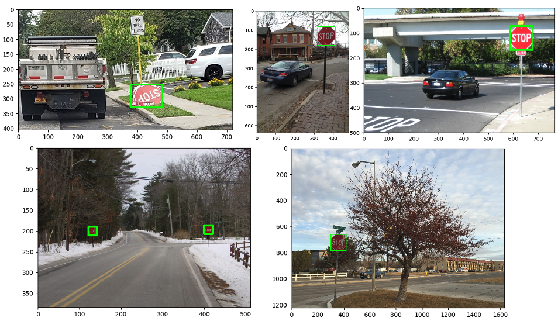

## PR2: SLAM using Particle Filter

This project implements SLAM with particle filters. It uses odometry and particle filter to localize the robot and then use occupancy grid to represent the map around the robot(as shown in the following figure).

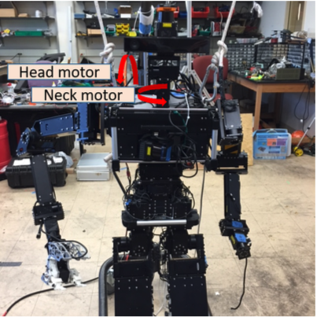

Results

| Map   | SLAM Results                                 |
| :---- | -------------------------------------------- |
| Map 0 | 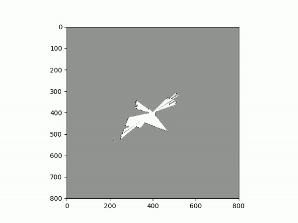 |
| Map 1 | 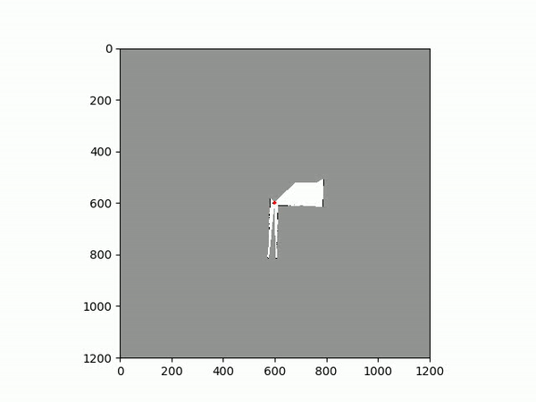 |
| Map 2 | 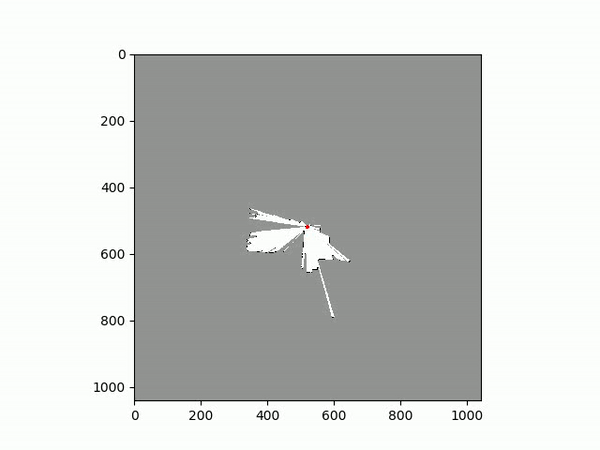 |
| Map 3 | 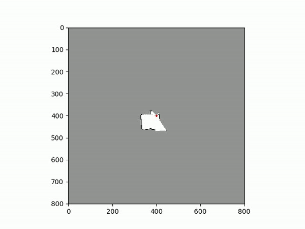 |
| Map 4 | 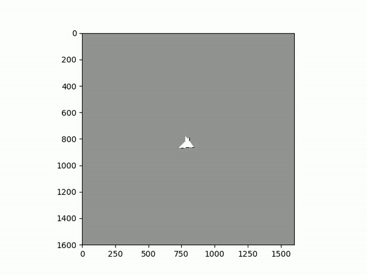 |

## PR3: Visual-Inertial Simultaneously Localization and Mapping (SLAM) using Extended Kalman Filter(EKF) 

In this project, I implement Visual- Inertial Simultaneous Localization and Mapping(SLAM) using the Extended Kalman Filter(EKF). I implemented IMU-based Localization via EKF prediction, Landmark Mapping via EKF update and a Visual-Inertial SLAM. The visual features matched across the left-right camera frames and across time are provided, as shown in the following image.

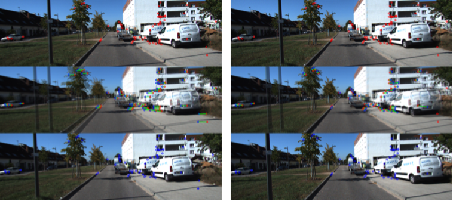

Using SLAM can signitifiantly improve the performance. The results are demonstrated below:

| Map      | Results                                    |
| -------- | ------------------------------------------ |
| Map 0022 | 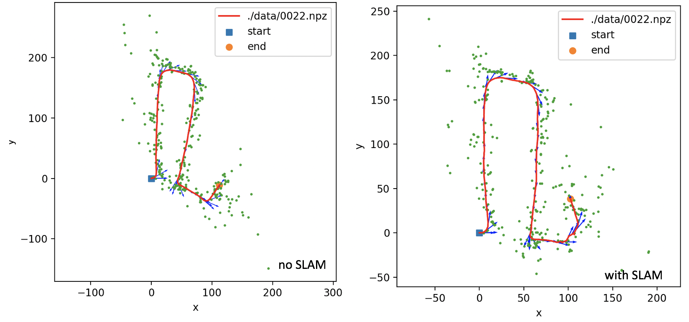 |
| Map 0027 | 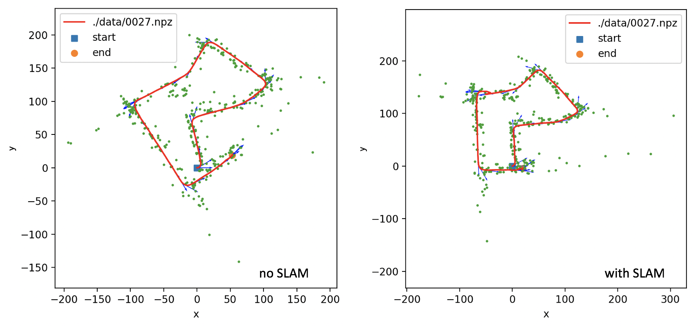 |
| Map 0034 | 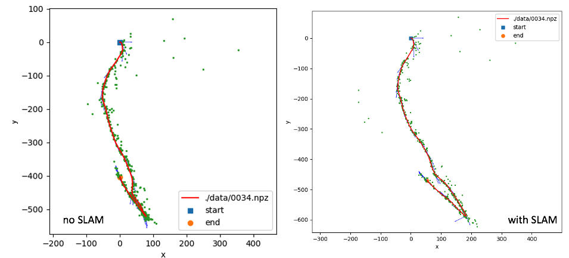 |

